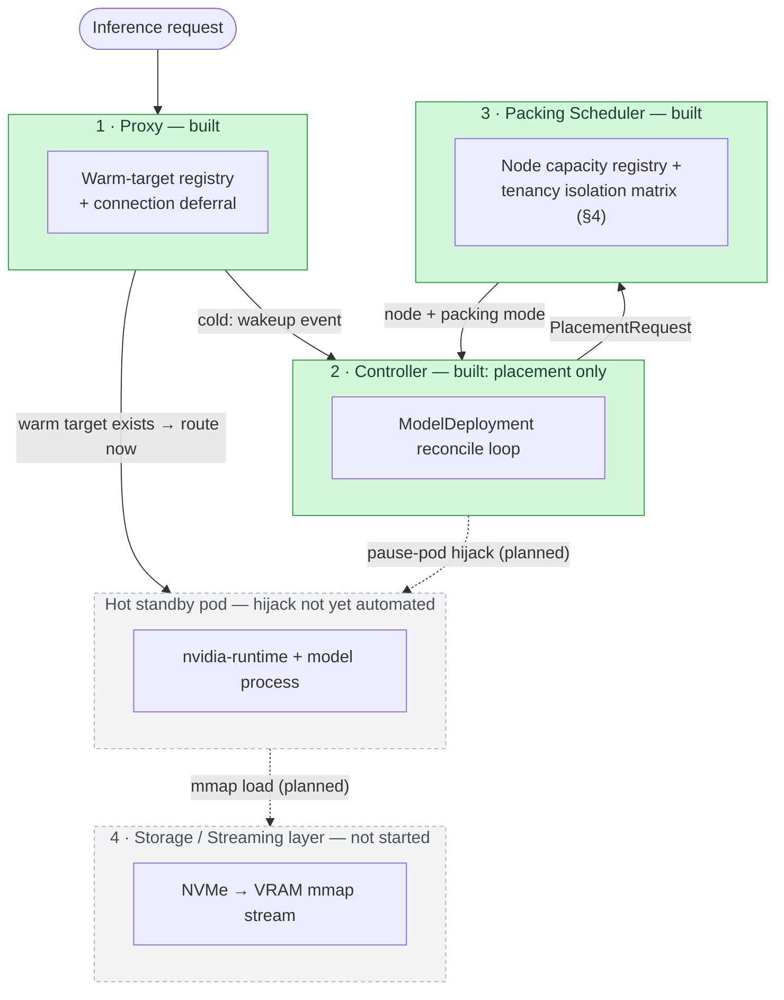

# Amphora

**Private GPU Fleet & Inference Economics Platform**

Amphora is an open-core Kubernetes operator + proxy + serving fabric that lets enterprises run
private LLM fleets with fast, bandwidth-bound cold starts, tenancy-certified multi-tenant GPU
packing (MIG/time-slicing), live cost & utilization observability, and an enforced (not just
logged) EU AI Act-grade audit trail.

> Status: **early development.** Proxy PoC, Packing Scheduler, and initial reconcile-loop
> placement logic have landed; pause-pod hijack, the admission webhook, and the storage/streaming
> layer are still ahead — see the [roadmap](#roadmap) below.

## Architecture

A **Cost & Audit Plane** (omitted above for clarity — see the Technical Specification's full
architecture diagram) cuts across all four components, tagging every request with
model/tenant/GPU-time/region.

Solid arrows are exercised by shipped code and tests today; dashed arrows are the planned
pause-pod hijack and storage-streaming paths — see the status note above and the
[roadmap](#roadmap) for what's implemented vs. designed-but-not-built.

## Why

Enterprises running LLMs on private infrastructure face three compounding problems: idle GPU cost
from naive scale-to-zero, poor utilization from one-model-per-GPU deployment, and no
audited control plane that isn't a US-hosted multi-tenant SaaS. See the full Technical
Specification for the detailed problem statement, architecture, threat model, and
tenancy/isolation guarantees.

## Benchmarks

Technical Specification §3.4.1 requires publishing the concurrent cold-start
degradation factor `f(N)` — how much slower N simultaneous cold starts are per-stream vs. a single
one — not just a cherry-picked single-request number. The harness lives in
[`benchmark/coldstart`](benchmark/coldstart).

**Sandbox validation run** (real measurement, *not* the official Phase 1 publication — see caveat
below):

| N (concurrent cold starts) | median stream time | per-stream throughput | aggregate throughput | `f(N)` |
|---|---|---|---|---|
| 1  | 0.305 s | 3.28 GB/s | 3.28 GB/s | 1.00 |
| 4  | 0.997 s | 1.00 GB/s | 3.83 GB/s | 3.27 |
| 8  | 1.643 s | 0.61 GB/s | 4.36 GB/s | 5.39 |
| 16 | 4.047 s | 0.25 GB/s | 3.90 GB/s | 13.27 |

Read this as: going from 1 to 16 concurrent cold starts makes each individual model load
**~13x slower**, even though aggregate NVMe throughput barely moves — the classic signature of
queue-depth saturation, which is exactly the non-linear effect §3.4.1 requires benchmarking
instead of assuming away.

⚠️ **This ran on a shared development sandbox** (single NVMe-backed volume, no GPU, no isolation
from other tenants of the same host) — not the dedicated reference hardware the spec requires for
a third-party-reproducible publication, and it measures the storage-layer term only (no GPU/VRAM
copy or pod-hijack scheduling latency, since that code doesn't exist yet). It's real data, not a
projection, but it's a lower bound on the full number, not the final one. See
[`benchmark/coldstart/README.md`](benchmark/coldstart/README.md) for full methodology and how to
run it yourself.

## Roadmap

- [x] **Phase 1** — Operator/CRD skeleton, proxy PoC (#4), concurrent cold-start benchmarking (#5)
- [ ] **Phase 2** — Multi-tenant packing:
  - [x] Packing Scheduler with tenancy-class enforcement (#6)
  - [x] Reconciler wired to the Packing Scheduler (#7)
  - [ ] Pause-pod over-provisioning + hijack — design not yet started, tracked once scoped
  - [ ] [Admission webhook](https://github.com/ramin-fazli/amphora/issues/9) (tenancy +
        residency validation) — `help wanted`
  - [ ] [mTLS between Proxy/Controller/Scheduler](https://github.com/ramin-fazli/amphora/issues/10)
        — `help wanted`
- [ ] **Phase 3** — Audit trail (WORM), eval/regression gate, multi-cluster orchestrator
- [ ] **Phase 4** — Cost-aware routing, predictive pre-warming, security review, GA hardening

Looking for something to pick up? Browse issues labeled
[`good first issue`](https://github.com/ramin-fazli/amphora/labels/good%20first%20issue) or
[`help wanted`](https://github.com/ramin-fazli/amphora/labels/help%20wanted) — the two Phase 2
items linked above are open now.

## Contributing

See [CONTRIBUTING.md](CONTRIBUTING.md). Security issues: see [SECURITY.md](SECURITY.md), do not
open a public issue.

## License

[Apache-2.0](LICENSE)
