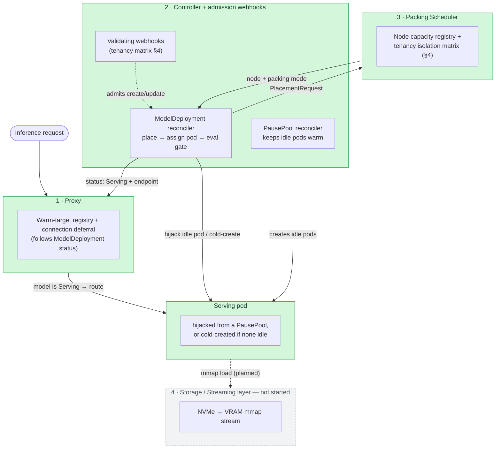

# Amphora

**Private GPU Fleet & Inference Economics Platform**

Amphora is an open-core Kubernetes operator + proxy + serving fabric that lets enterprises run
private LLM fleets with fast, bandwidth-bound cold starts, tenancy-certified multi-tenant GPU
packing (MIG/time-slicing), live cost & utilization observability, and an enforced (not just
logged) EU AI Act-grade audit trail.

> Status: **early development, not production-ready.** The control path works end to end on a
> real Kubernetes cluster (admission, placement, pod assignment, quality gate, routing), but it
> has only ever run against a GPU-less stub model: nothing here has been validated on real GPUs,
> MIG, or large models yet, and the storage/streaming layer, mTLS, and the
> audit trail are not built. See [What works today](#what-works-today) and the
> [roadmap](#roadmap).

## Architecture



A **Cost & Audit Plane** cuts across all four components in the Technical Specification. Only its
first piece exists today: the proxy tags each routed request with model/tenant headers. The WORM
audit trail, cost accounting, and region tagging are not built.

The Proxy and Controller are decoupled through the `ModelDeployment` status rather than a
separate RPC channel: the controller publishes `status.endpoint` only while a deployment is
`Serving`, and the proxy (run with `-sync-from-cluster`) watches those objects. There is no
gRPC link, so there is also no proxy → controller wakeup path yet (nothing scales to zero).

## What works today

All of this is covered by unit/envtest tests and a kind-cluster end-to-end suite
(`make test-e2e`, 13 specs, also run in CI):

- **`ModelDeployment` CRD** (`amphora.amphora.sh/v1alpha1`) with an immutable `tenancyClass`
  (`SingleTenant` / `TrustedMultiTenant` / `RegulatedMultiTenant`), `gpuFraction` (MIG profile),
  `allowedRegions`, and `evalGate`.
- **Admission webhooks** (`ModelDeployment`, `PausePool`) that reject at create/update: a
  regulated spec without a MIG `gpuFraction` or `allowedRegions`, malformed MIG profiles, and
  slice/tenancy combinations that violate the §4 matrix. They reuse the scheduler's own rules.
  Failure policy is `Fail`.
- **Packing Scheduler**: best-fit VRAM bin-packing that independently enforces the tenancy
  isolation matrix at placement time (defense in depth with the webhook).
- **Data residency** (`allowedRegions`): placement only onto nodes whose standard
  `topology.kubernetes.io/region` label is listed, failing closed (an unlabeled node never
  matches). It is re-checked on every reconcile: if the spec changes or a node is relabeled so a
  running deployment is out of region, its pod is deleted, traffic stops, and it is re-placed.
- **Pause-pod pool**: a `PausePool` CRD keeps a fixed number of idle, node-pre-bound pods warm per
  node/tenancy/slice. A scheduled deployment **hijacks** an idle pod in place (image swap plus a
  model annotation read through the downward API), and the pool refills. If no pool has an idle
  pod, the controller **cold-creates** a pod instead, counted by
  `amphora_controller_cold_create_fallbacks_total`.
- **Eval gate** before any traffic flip: the pod must be Ready and pass a health probe within
  `timeoutMillis`, and, if `canaryConfigMapRef` is set, answer every canary prompt exactly as
  expected (`/v1/completions`, exact match). It **fails closed**: a failed pod is deleted, and
  after 3 consecutive failures promotion pauses until an operator approves. Without canaries only
  latency is checked and `QualityVerified` stays `False`.
- **Proxy** with connection deferral (requests for a not-yet-warm model are held open rather than
  failed), namespace-qualified model keys (`X-Amphora-Model: <namespace>/<name>`), and routing only
  to deployments that have passed the gate.

## Known limitations

- **No real-GPU validation.** The e2e uses a stub model server and maps the `nvidia`
  RuntimeClass to `runc`. MIG, time-slicing, and vLLM behavior are untested.
- **Residency depends on node labels and is narrow.** Nodes must carry
  `topology.kubernetes.io/region`; without it, region-constrained deployments stay `Pending`.
  Eviction when a deployment drifts out of region is abrupt (no drain), placements live in the
  controller's memory and are re-derived after a restart, and only `ModelDeployment` placement is
  covered (not failover across clusters, which does not exist yet).
- **Quality checking is exact-match only.** Embedding-similarity and judge-model matchers from the
  spec are not implemented, and one shared deadline covers the health probe plus all canaries.
- **Pools are single-namespace** and statically sized; there is no cross-namespace sharing and no
  predictive sizing.
- **No mTLS** between components, and the webhook's cert-manager certificate path is build-checked
  but not exercised in CI (the e2e mints its own certificates).
- `config/default` still references the deprecated `kube-rbac-proxy` image and is not deployed
  in CI; the proxy image is not part of the release workflow yet.

## Try it

Requires Go (see `go.mod`) and, for the end-to-end suite, Docker.

```bash
make test        # unit + envtest (downloads Kubernetes control-plane binaries)
make test-e2e    # builds images, creates a throwaway kind cluster, runs the full path, deletes it
make lint        # golangci-lint
make kustomize-check   # config/default must build
```

`make test-e2e` uses its own kubeconfig under `bin/` and refuses to run against any other
cluster. `make run` runs the controller locally with webhooks disabled (no local certificate).

## Why

Enterprises running LLMs on private infrastructure face three compounding problems: idle GPU cost
from naive scale-to-zero, poor utilization from one-model-per-GPU deployment, and no
audited control plane that isn't a US-hosted multi-tenant SaaS. See the full Technical
Specification for the detailed problem statement, architecture, threat model, and
tenancy/isolation guarantees.

## Benchmarks

Technical Specification §3.4.1 requires publishing the concurrent cold-start
degradation factor `f(N)` — how much slower N simultaneous cold starts are per-stream vs. a single
one — not just a cherry-picked single-request number. The harness lives in
[`benchmark/coldstart`](benchmark/coldstart).

**Sandbox validation run** (real measurement, *not* the official Phase 1 publication — see caveat
below):

| N (concurrent cold starts) | median stream time | per-stream throughput | aggregate throughput | `f(N)` |
|---|---|---|---|---|
| 1  | 0.305 s | 3.28 GB/s | 3.28 GB/s | 1.00 |
| 4  | 0.997 s | 1.00 GB/s | 3.83 GB/s | 3.27 |
| 8  | 1.643 s | 0.61 GB/s | 4.36 GB/s | 5.39 |
| 16 | 4.047 s | 0.25 GB/s | 3.90 GB/s | 13.27 |

Read this as: going from 1 to 16 concurrent cold starts makes each individual model load
**~13x slower**, even though aggregate NVMe throughput barely moves — the classic signature of
queue-depth saturation, which is exactly the non-linear effect §3.4.1 requires benchmarking
instead of assuming away.

⚠️ **This ran on a shared development sandbox** (single NVMe-backed volume, no GPU, no isolation
from other tenants of the same host) — not the dedicated reference hardware the spec requires for
a third-party-reproducible publication, and it measures the storage-layer term only (no GPU/VRAM
copy or pod-hijack scheduling latency, since that code doesn't exist yet). It's real data, not a
projection, but it's a lower bound on the full number, not the final one. See
[`benchmark/coldstart/README.md`](benchmark/coldstart/README.md) for full methodology and how to
run it yourself.

## Roadmap

- [x] **Phase 1** — Operator/CRD skeleton, proxy PoC (#4), concurrent cold-start benchmarking (#5)
- [x] **Phase 2** — Multi-tenant packing (software path complete; hardware-unvalidated):
  - [x] Packing Scheduler with tenancy-class enforcement (#6) and reconciler wiring (#7)
  - [x] Pause-pod pool (#13), hijack (#14), and cold-create fallback (#15)
  - [x] Admission webhooks for tenancy (#21; [#9](https://github.com/amphoralabs/amphora/issues/9))
  - [x] Residency enforcement against the node region label (#23)
  - [ ] [mTLS between Proxy/Controller/Scheduler](https://github.com/amphoralabs/amphora/issues/10)
        — `help wanted`
- [ ] **Phase 3** — Audit trail (WORM), eval/regression gate, multi-cluster orchestrator
  - [x] Eval gate: fail-closed health probe (#16) and exact-match canaries (#19)
  - [ ] Other matchers (embedding similarity, judge model), WORM audit trail, multi-cluster
- [ ] **Phase 4** — Cost-aware routing, predictive pre-warming, security review, GA hardening
- [ ] **Not yet scheduled** — storage/streaming layer (NVMe → VRAM), real-GPU reference-hardware
      benchmark, scale-to-zero and proxy → controller wakeup

Looking for something to pick up? Browse issues labeled
[`good first issue`](https://github.com/amphoralabs/amphora/labels/good%20first%20issue) or
[`help wanted`](https://github.com/amphoralabs/amphora/labels/help%20wanted).

## Contributing

See [CONTRIBUTING.md](CONTRIBUTING.md). Security issues: see [SECURITY.md](SECURITY.md), do not
open a public issue.

## License

[Apache-2.0](LICENSE)
